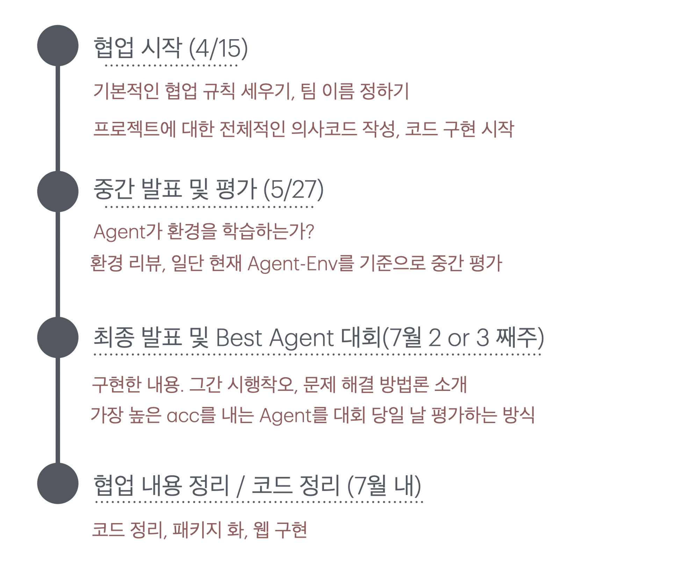

# 7주차 강화학습 세션

## 요약
- 방학까지 진행할 강화학습 테스크를 공개 및 진행 방식에 대해 소개했습니다. 
- 팀을 구성하고, 협업을 위한 기반을 쌓았습니다. 

## 강화학습 테스크 공개 
 **"강화학습으로 해결하는 지뢰찾기"**
 기간 : 2024.04-07
 테스크 진행 방식 : 동아리 내 간이 대회 
 조구성 : 4인 1조
 | 지뢰마스터즈 |  |  |
| --- | --- | --- |
| 1팀 | 주민서 | 김도희 |
| 2팀 | 이정연 | 손주현 |

| AI 폭탄 제거 부대 |  |  |
| --- | --- | --- |
| 1팀  | 변지은 | 이승연 |
| 2팀 | 이은나 | 김정은 |

## 타임라인

## 협업 기반 다지기
1. 조별로 코딩 규칙 정하기 
2. ReadMe 형식 및 규칙 정하기 
3. 팀 이름 정하기 
4. 결과, 레퍼런스, 개발 일지 작성 규칙 정하기

## 사진

