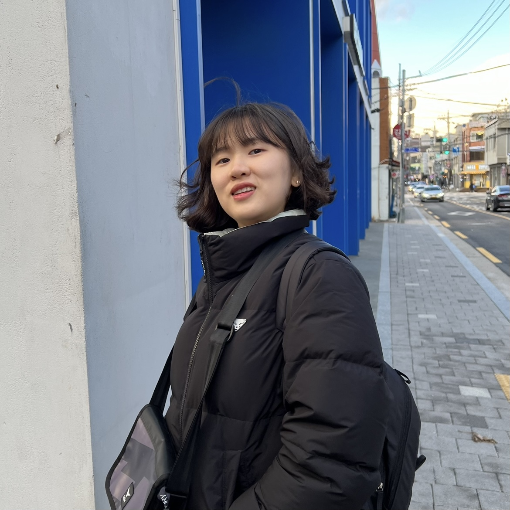
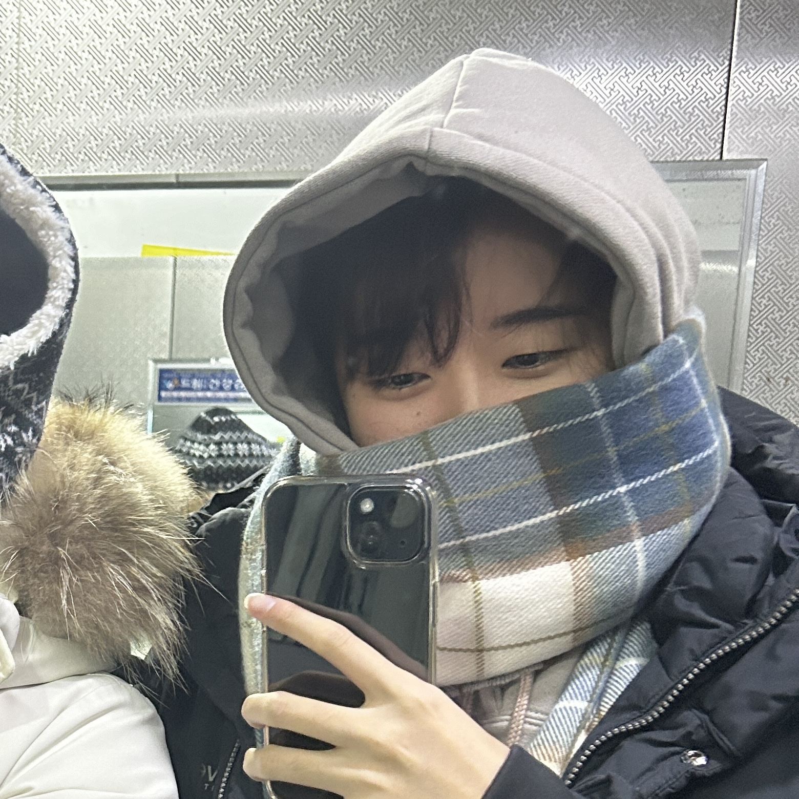
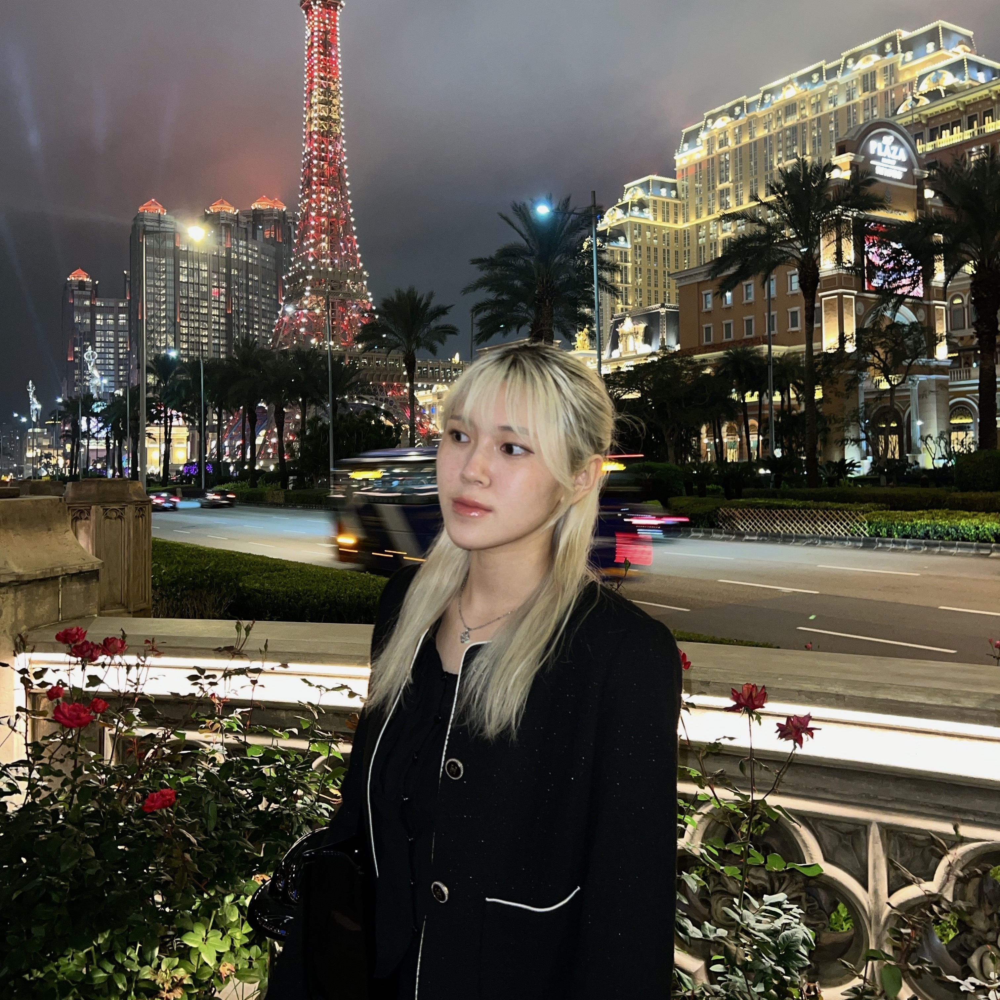
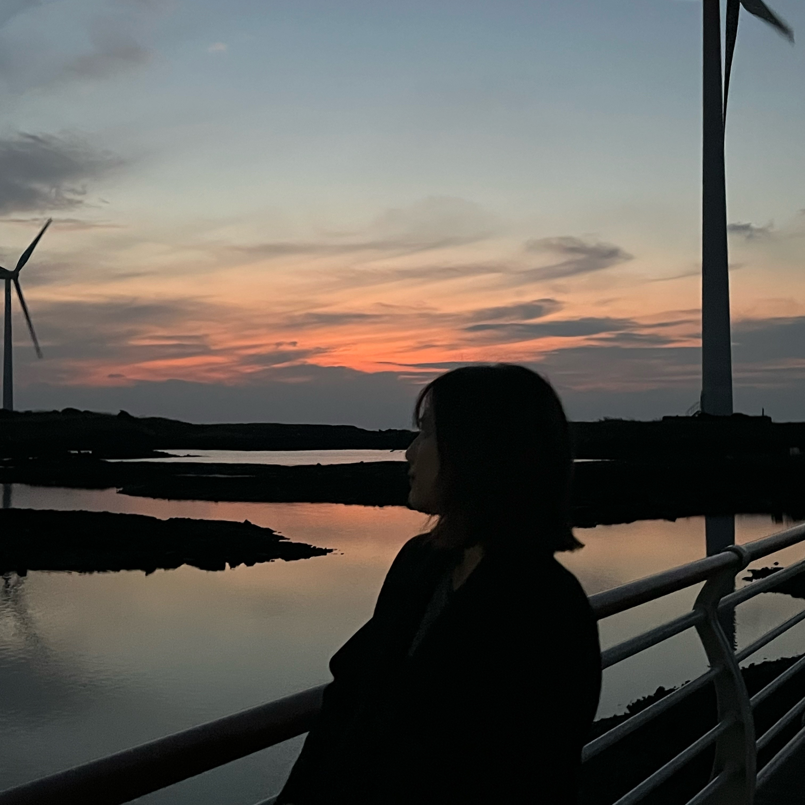
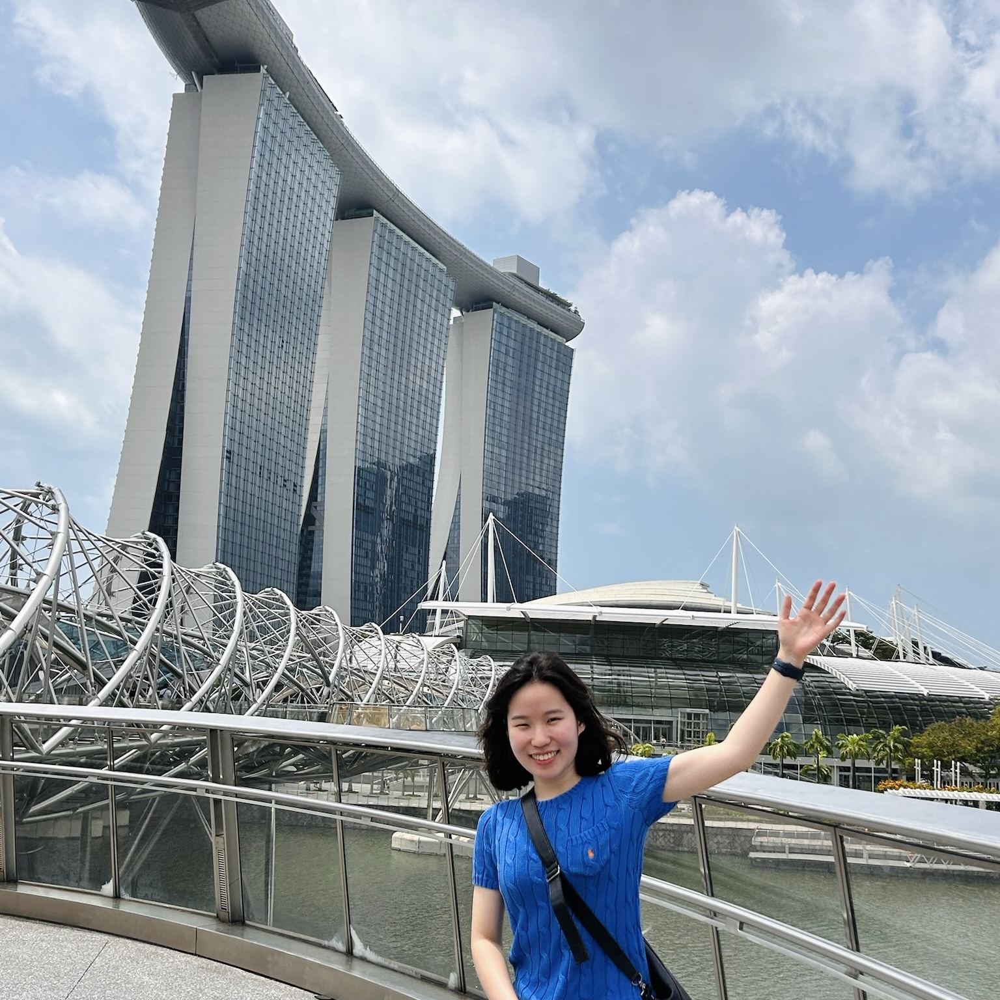
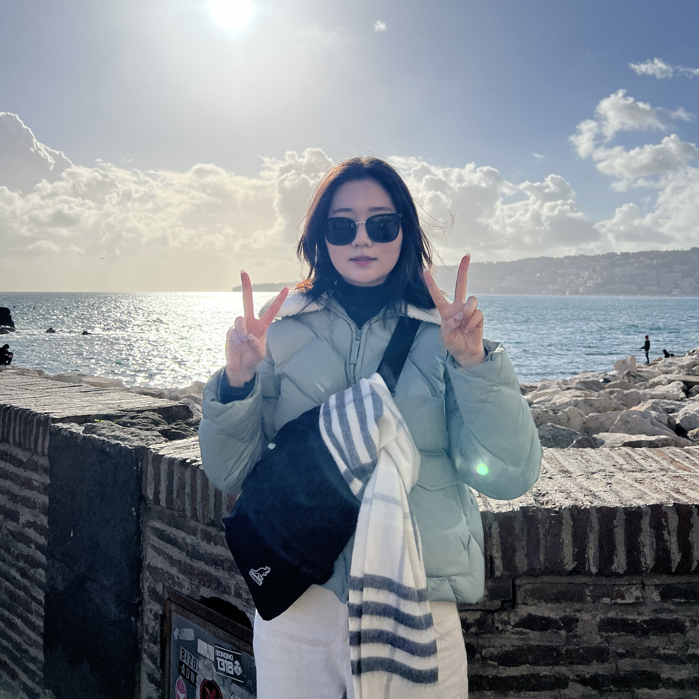
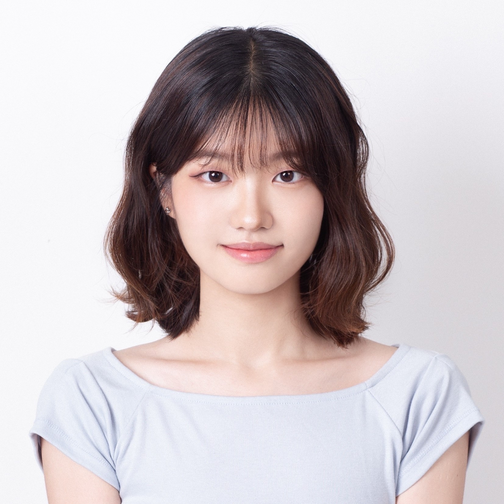
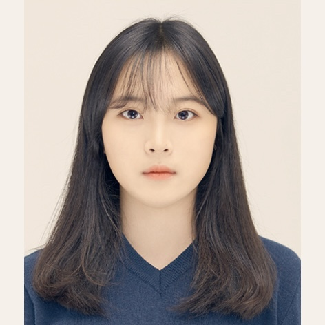

## 강화시스터즈 동아리원을 소개합니다! 
역대 운영진과 동아리원들을 소개합니다!  
현재 활동 중인 동아리원은 흰색, 활동을 완료한 동아리원은 <b style="background-color:#f1f3f5;">회색</b>으로 구분되어 있습니다. 

### 어떤 정보를 확인할 수 있나요? 
✔️ 동아리원들의 <b style="background-color:#f6e705;">직책 + 전공</b>을 알 수 있어요.  
✔️ 흥미로운 동아리원들이 있다면 <b style="background-color:#f6e705;">메일</b>로 연락할 수 있어요.  
✔️ <b style="background-color:#f6e705;">깃허브</b>를 통해 현재 활동을 볼 수 있어요.  
✔️ <b style="background-color:#f6e705;">태그</b>를 통해 동아리원들이 동아리 활동 중 작성한 글들을 확인할 수 있어요.  

### 🔥 기수별 바로가기 
- [👩‍💻 운영진](#👩‍💻-운영진)  
- [📕 1기](#1기-24-1)  
- [📕 2기](#2기-24-2)  

## 👩‍💻 운영진 
<table border="0">
 <tr>
    <td> 
    
    </td>

<td>
<b style="font-size:15px">이지민 (Jimin Lee)</b> 

동아리 설립자, 1-2기 운영진   
    통계학 주전, 계산과학 복전     
         
        
        

    
</td>
</tr>
</table>

## 📕 동아리원
### 1기 (24-1)
<table border="0" style="width: 150%; border-collapse: collapse; table-layout: fixed;">
 <tr>
    <td> 
    
    </td>

<td>
<b style="font-size:15px">이승연 (Seungyeon Lee)</b> 
 
1-2기 총무  
통계학 주전, 경제 복전     
         
        
        
</td>

<td> 
    
    </td>

<td>
<b style="font-size:15px">이은나 (Eunna Lee)</b> 
 
통계학 주전, 계산과학 복전       
         
        
        
</td>
</tr>

<tr>
    <td style="background-color:#f1f3f5;"> 
    
    </td>

<td style="background-color:#f1f3f5;">
<b style="font-size:15px">변지은 (Jieun Byeon)</b> 
 
컴퓨터 공학 주전     
         
        
        
</td>

<td style="background-color:#f1f3f5;"> 
    
    </td>

<td style="background-color:#f1f3f5;">
<b style="font-size:15px">손주현 (Juhyun Son)</b> 
 
컴퓨터 공학 주전     
         
        
        
</td>
</tr>

<tr>
    <td> 
    
    </td>

<td>
<b style="font-size:15px">김도희 (DoHee Kim)</b> 
 
통계학 주전, 수학/계산과학 복전     
         
        
        
</td>

<td style="background-color:#f1f3f5;"> 
    
    </td>

<td style="background-color:#f1f3f5;">
<b style="font-size:15px">김정은 (Jungeun Kim)</b> 
 
화학나노과학 주전    
         
        
        
</td>
</tr>

<tr>
    <td style="background-color:#f1f3f5;"> 
    
    </td>

<td style="background-color:#f1f3f5;">
<b style="font-size:15px">주민서 (Minsuh Joo)</b> 
 
인공지능 주전     
         
        
        
</td>

<td> 
    
    </td>

<td>
<b style="font-size:15px">이정연 (Jungyeon Lee)</b> 
 
인공지능 주전     
         
        
        
</td>
</tr>
</table>

### 2기 (24-2)
<table border="0" style="width: 150%; border-collapse: collapse; table-layout: fixed;">
 <tr>
    <td>
        </td>
    <td>
        <b style="font-size:15px">이채연 (Chaeyeon Lee)</b> 

        문헌정보학 주전, 통계학 복전    
        
        
        
    </td>
    <td>
    
    </td>
    <td>
    <b style="font-size:15px">장예원 (Yewon Jang)</b> 

    통계학 주전, 경영학 복전    
    
    
    
    </td>
</tr>
<tr>
    <td>
        
    </td>
    <td>
    <b style="font-size:15px">김현서 (Hyunseo Kim)</b> 

    로보틱스 담당  
    휴먼기계바이오공학과 전공    
    
    
    
    </td>
    <td>
        
    </td>
    <td>
        <b style="font-size:15px">안서연 (Seoyeon Ahn)</b> 

        컴퓨터공학 주전, 생명과학 복전      
        
        
        
    </td>

</tr>
</table>
